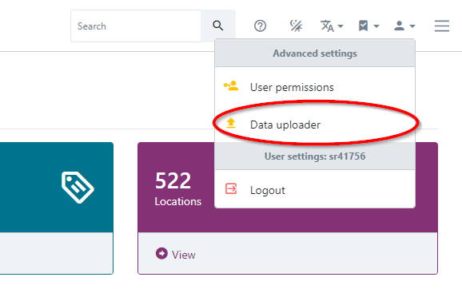
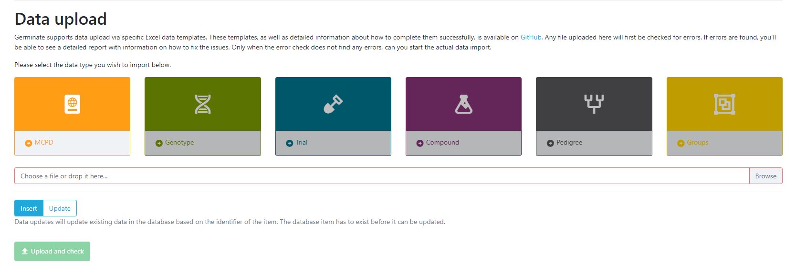
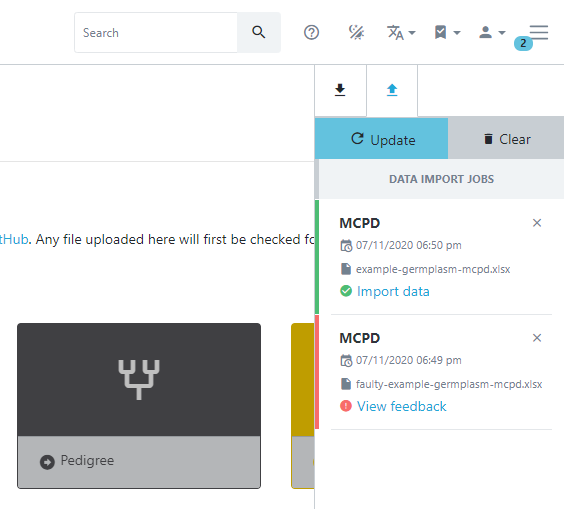

# Germinate Data Import

Once Germinate is running and properly set up, the next step is to get your data into the system.

For this purpose, we have developed a number of [Excel data templates](https://github.com/germinateplatform/germinate-data-templates) that can easily be imported into Germinate using the web interface.

These data templates currently cover the following data type:

- Germplasm passport data ([MCPD](https://www.bioversityinternational.org/e-library/publications/detail/faobioversity-multi-crop-passport-descriptors-v21-mcpd-v21/))
- Genotypic marker data
- Pedigree data
- Trials data
- Chemical compound data

As a requirement for the data import, [Gatekeeper](https://github.com/germinateplatform/gatekeeper-vue) has to be running and there has to be a Gatekeeper user that has either administrator or data curator permissions set for the Germinate database in question.

## How to import data

To upload a data template to Germinate, select the "Data Uploader" from the user menu on the Germinate web interface.

Then select the type of data you wish to upload, select the Excel data template file and press "Upload and check". The file will be checked asynchronously and the side panel will pop up showing you the progress of the import.
When the process finishes, you will either have checked the file and not found any issues or it will return a detailed report highlighting all issues within the data so you can fix them before finally uploading the data again. 

