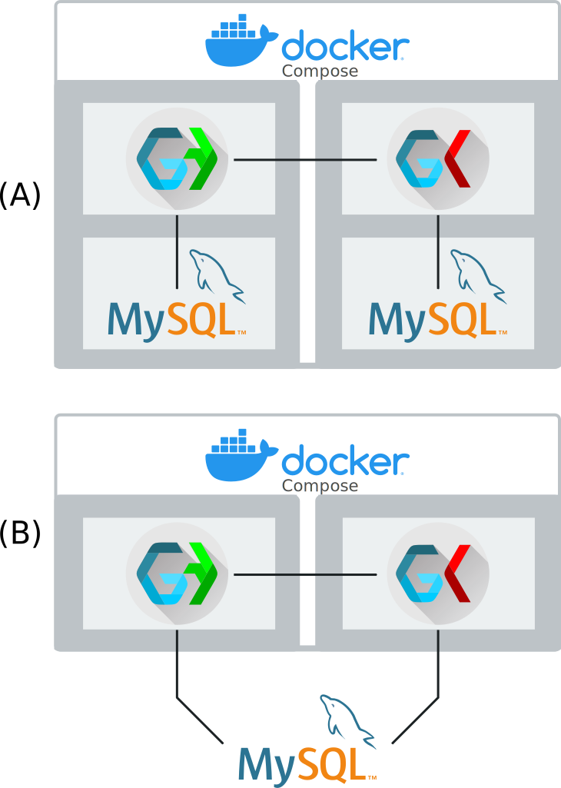

# Germinate Setup

There are many ways in which you can run Germinate.

If you are familiar with Docker and containerization, then the Germinate Docker container is probably the best option.
It requires the least amount of configuration, assuming you already have a working Docker environment. If Docker is an alien concept to you, then a manual build of Germinate will most likely be the best option.

The following page will take you through both scenarios and explain all the necessary steps to get Germinate up and running.

- [Docker](#docker)
- [Manual setup](#manual-setup)
  - [Requirements](#requirements)
  - [Germinate Client](#client)
    - [Download](#download-germinate-client)
    - [Configure](#configure-germinate-client)
    - [Build](#build-germinate)
  - [Germinate Server](#server)
    - [Download](#download-germinate-server)
    - [Configure](#configure-germinate-server)
    - [Include client](#include-germinate-client)
    - [Build](#build-germinate-server)
 - [Proxy](#proxy)

## Docker

Let's start with the simpler case: Docker. We have a working Docker image of Germinate available on [DockerHub](https://hub.docker.com/repository/docker/cropgeeks/germinate) that you can simply pull and run on your machine/server.

Additionally you will need a MySQL database. This can either be another Docker container or an existing database server that you already have. The examples below contain a Docker MySQL container. If you wish to use your own database, simply remove the relevant parts from the docker file or docker commands.

If you have docker-compose available, things are as simple as defining this `docker-compose.yml` file. Only change the parts that have comments above them.

```yaml
version: '3.3'
services:
  mysql:
    image: mysql:5.7
    ports:
      - 9306:3306
    volumes:
      - type: volume
        source: mysql
        target: /var/lib/mysql/
    environment:
      # The root password. This is not used by Germinate, but can be used to access the database externally
      MYSQL_ROOT_PASSWORD: PASSWORD_HERE
      # The name of the Germinate database, e.g. "germinate"
      MYSQL_DATABASE: GERMINATE_DATABASE_NAME
      # The username Germinate will use to connect to this database
      MYSQL_USER: DATABASE_USER
      # The password Germinate will use to connect to this database
      MYSQL_PASSWORD: DATABASE_PASSWORD
    restart: unless-stopped
    container_name: mysql

  tomcat:
      image: cropgeeks/germinate:release-<version>
      environment:
        - JAVA_OPTS:-Xmx512m
      ports:
        - 9080:8080
      volumes:
        - type: bind
          # This points to where your Germinate configuration folder is outside the container
          source: /path/to/your/germinate/config
          target: /data/germinate
        - type: volume
          source: germinate
          target: /usr/local/tomcat/temp
      restart: unless-stopped
      container_name: germinate
      depends_on:
        - "mysql"

volumes:
  germinate:
  mysql:
```

If you don't use docker-compose, here is an example of those same instructions as basic Docker commands. See the comments in the `docker-compose.yml` file above to see which parts need changing:

```shell
docker volume create germinate
docker volume create mysql

docker network create germinate

docker run -d \
    --name mysql \
    --network germinate \
    -e MYSQL_ROOT_PASSWORD=ROOT_PASSWORD_HERE \
    -e MYSQL_DATABASE=GERMINATE_DATABASE_NAME \
    -e MYSQL_USER=DATABASE_USER \
    -e MYSQL_PASSWORD=DATABASE_PASSWORD \
    -v mysql:/var/lib/mysql \
    -p 9306:3306 \
    --restart unless-stopped \
    mysql:5.7

docker run -d \
    --name germinate \
    --network germinate \
    -e JAVA_OPTS=-Xmx512m \
    -v germinate:/usr/local/tomcat/temp \
    -v /path/to/your/germinate/config:/data/germinate \
    -p 9080:8080 \
    --restart unless-stopped \
    cropgeeks/germinate:release-<version>
```

Make sure you have at least a `config.properties` file in the location at `/path/to/your/germinate/config`. See <a href="config.html">Configuration</a> for additional config options. This file will contain the database configuration and also this property:

```ini
# This is the folder inside Docker, don't set this to your config folder location as this is taken care of by a Docker bind.
data.directory.external=/data/germinate
```

**Tip**: When using the setup as described above, make sure to set the `database.server` property in the `config.properties` file to `mysql`, as this is the address of the database within the Docker network. If you rename the MySQL service, please use that new name.

### Possible setup options



The figure above shows exemplar configuration options for Docker. Option (A) shows Germinate and Gatekeeper in a single Docker compose file each with their own MySQL Docker container. In total, there would be 4 Docker images: Germinate, Gatekeeper, MySQL for Germinate and MySQL for Gatekeeper. This is the easiest option to set up. See <a href="setup-example.html">the setup example</a> for more information on this configuration. Option (B) shows Germinate (and Gatekeeper) using an externally provided MySQL server while they run as two Docker images in a Docker compose.

## Manual setup

Setting up Germinate manually involves a few steps that have to be done for every new release.

### Requirements

Server:
- Java 21 or above
- Tomcat 10.1 or above
- MySQL 5.7.37 or above
- imagemagick 6.9.10 or above
- Gradle 8.8 or above
- gdal 3.0.4 or above

Client:
- Node.js 22.11.0 or above
- NPM 10.9.0 or above

We are going to assume that you have a running Tomcat and a running MySQL database that we can link into.

Make sure that your MySQL server contains an empty database (or a database from a version 3 release of Germinate). The name of this database is then used in the [server configuration section](#configure-germinate-server).

An exemplar command to create such a database is:

```shell
mysql -u root -e "create database germinate;"
```

### Client

The steps involved to build the client of Germinate are as follows:

1. Download the Germinate Client code from GitHub
2. Set up the configuration file
3. Build Germinate

#### Download Germinate Client
You can either download the code from GitHub directly via the [releases](https://github.com/germinateplatform/germinate-vue/releases) or you can check out the latest release via the command line: 

```shell
git clone -b '<version>' --depth 1 https://github.com/germinateplatform/germinate-vue.git
```

#### Configure Germinate Client
Run this from within the root directory of the source code to install all dependencies:

```shell
npm i
```


Create a file called `.env` and add this to it:

```ini
VUE_APP_BASE_URL=./api/
```

Where `project.name` comes from the Germinate Server configuration below.

#### Build Germinate

Run this to build Germinate:

```shell
npm run build
```

This will generate HTML and JS files inside the `dist` directory. We will now move on to the build process of the server code.

### Server

Setting up the server involves the following steps:

1. Download the Germinate Server code from GitHub
2. Set up the configuration file and the external configuration directory
3. Include the client code in the deploy
4. Build and deploy Germinate Server to Tomcat

Let's go through these steps one at a time.

#### Download Germinate Server
You can either download the code from GitHub directly via the [releases](https://github.com/germinateplatform/germinate-server/releases) or you can check out the latest release via the command line: 

```shell
git clone -b '<version>' --depth 1 https://github.com/germinateplatform/germinate-server.git
```

#### Configure Germinate Server

Rename `config.template.properties` to `config.properties` and `gradle.template.properties` to `gradle.properties`.

Change `gradle.properties` like this:

```ini
tomcat.manager.version=<your tomcat version, e.g. 'tomcat10x'>
tomcat.manager.protocol=<protocol of tomcat, e.g. 'http'>
tomcat.manager.hostname=<host of tomcat, e.g. 'localhost'>
tomcat.manager.port=<port of tomcat, e.g. '8080'>
tomcat.manager.username=<tomcat username>
tomcat.manager.password=<tomcat password>

project.name=<the relative path inside tomcat, e.g. 'germinate' -> http://localhost:8080/germinate/v<version>>
```

Change `config.properties` like this:

```ini
data.directory.external = <path to the configuration directory>
```

The configuration directory and its content are described in the <a href="config.html">configuration options</a>.

#### Include Germinate Client

Copy the whole content of the `dist` directory within the Germinate Client source into the `client` directory within the Germinate Server source (you may have to create a `client` folder at the root level of the project). 

#### Build Germinate Server

Once all previous steps are complete, building Germinate Server is as simple as calling:

```shell
gradle deployTomcat
```

After the build process is complete, the Germinate API will be available at the specified location (`<tomcat-url>/<project.name>/v<version>`).


## Proxy

If Germinate is sitting behind a proxy, further setup may be required. We'll give an example that shows you how to set up Apache and Nginx to properly work with Germinate.

### Germinate running on sub-path of domain
#### Apache
```
# Allow rewrite rules
RewriteEngine on
# Preserve request URL
ProxyPreserveHost On

# Make sure trailing slashes are added
RewriteRule     ^/germinate$ /germinate/ [R]

# Define the mapping
<Location /germinate/>
    ProxyPass        http://internalserver:1234/
    ProxyPassReverse http://internalserver:1234/

    # Make sure cookies get the correct path
    ProxyPassReverseCookiePath / /germinate  
</Location>
```

#### Nginx

```
location /germinate/ {
  proxy_pass http://internalserver:1234/;
  proxy_cookie_path / /germinate/;
  proxy_set_header Host $host;
  proxy_set_header X-Forwarded-For $remote_addr;
}
```

The example above maps `/germinate/` on your public server to an internal server `http://internalserver:1234/`. The other settings make sure that trailing slashes are automatically added and that the original request URL are passed through. The latter is important for links placed in exported data files. As an example, Germinate includes links back to Germinate into Flapjack files so that users of Flapjack can easily see the passport page of a specific germplasm.

### Germinate running as a subdomain
#### Apache

```
# Allow rewrite rules
RewriteEngine on
# Preserve request URL
ProxyPreserveHost On

# Define the mapping
<Location />
    ProxyPass        http://internalserver:1234/
    ProxyPassReverse http://internalserver:1234/
</Location>
```

#### Nginx

```
location / {
  proxy_pass http://internalserver:1234/;
  proxy_set_header Host $host;
  proxy_set_header X-Forwarded-For $remote_addr;
}
```

**NOTE**: If Germinate is running on a sub-path on the internal machine (for example `http://internalserver:1234/germinate/`) make sure to adjust the mappings and the cookie path adjustments accordingly. 

When you copy the example above, make sure to replace "germinate" with the mapping you want to use publicly and "http://internalserver:1234/" with your internal server.